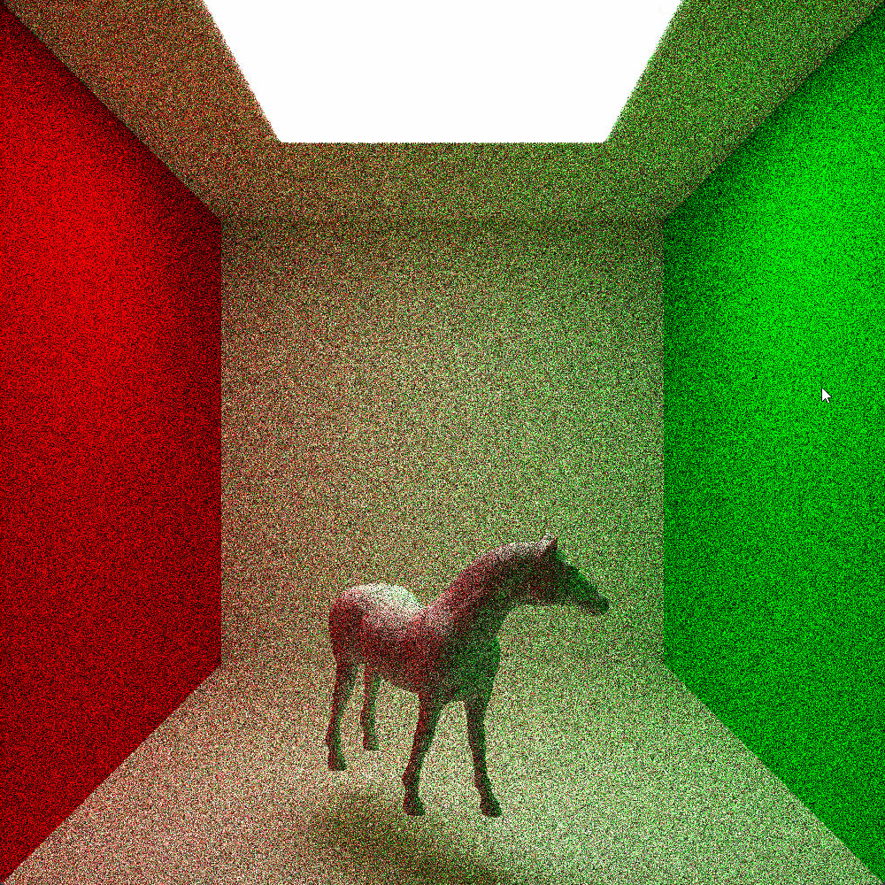

# 太极图形课S1-大作业


## 作业来源
路径追踪是目前计算机图形学中进行三维渲染的主流算法，因其生成的图像真实感强，广泛应用于静态图、电影等离线渲染上。随着目前GPU算力的不断增强，电子游戏等实时渲染领域也逐渐采用光栅化和路径追踪的方法来增强画面效果。

本次大作业通过太极编程语言完成了一个简单的路径追踪渲染器，该渲染器支持OBJ文件的导入和渲染。但因时间原因，没有实现OBJ的纹理映射和各类空间求交加速算法。

在实现本大作业中，参考了太极图形课的路径追踪示例程序 ([链接](https://github.com/taichiCourse01/taichi_ray_tracing))

## 运行方式
#### 运行环境：
`[Taichi] version 0.8.8, llvm 10.0.0, commit 7bae9c77, win, python 3.9.7`

#### 运行：

`python path_tracing_obj.py`

- 使用 默认OBJ文件:
需保证`model`文件夹和`path_tracing_obj.py`文件位于同一路径下

- 使用 自定义 OBJ文件:
可以修改`path_tracing_obj.py`文件中`scene_init`开头的函数以加载自定义模型，需注意可能需要对模型进行三维几何变换以让模型以合适的大小、位置、角度显示在屏幕上


## 效果展示
下面为在康纳盒中显示不同OBJ模型的效果图




## 整体结构
```
-LICENSE
-|data
-|model
-README.MD
-path_tracing_obj.py
-requirements.txt
```

## 实现细节：
`path_tracing_obj.py`是项目源代码，其中包含`Ray`类、`Triangle`类、`Model`类、`ModelSphere`类、`Scene`类、路径追踪中用到的反射折射方向计算函数和路径追踪函数、渲染函数、场景加载函数和`main`函数。

### 整体流程
1. 执行场景加载函数，用OBJ文件实例化`Model`类，对`Model`对象执行三维几何变换，将`Model`对象添加到`Scene`类中
2. 执行渲染函数，对屏幕上每个像素计算射线方向并调用路径追踪函数获取其颜色，将其写入帧缓冲器
3. 在路径追踪函数依照路径追踪算法不断迭代，直到到达最大深度或与光源相交
4. 在GUI中显示帧缓冲器中的图像
